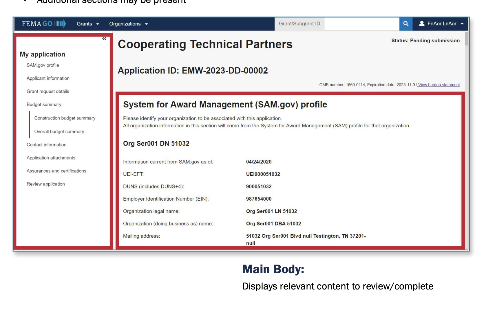
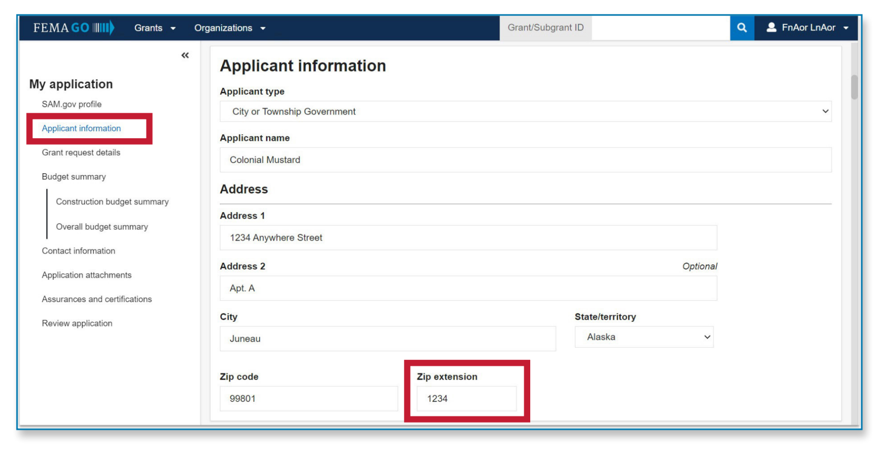
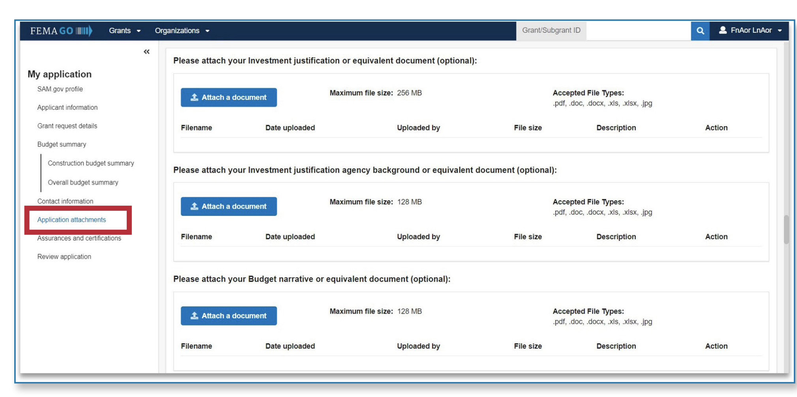

# FEMA Grant-Making Service Design Case Study

## Executive Summary

This case study examines a federal grant-making platform intended to support multiple programs, including Public Assistance, Mitigation, and Preparedness.

The work began as an effort to improve application consistency. Through service design analysis, a deeper issue emerged:

> The system improved the interface, but not the data or grant-making capability.

By reframing the problem around data interoperability, service outcomes, and cross-program reuse, this work identifies a path to reduce burden, improve review confidence, and strengthen oversight.

---

## Where This Started

The platform was designed around structured application workflows.

On the surface, the experience appeared organized. Navigation was clear, sections were defined, and some data could be pulled from authoritative systems.

But the structure had limits. Users still moved through program-specific workflows, validated information that already existed elsewhere, and relied on separate steps before work could proceed.

When the system could not capture structured data, it fell back to attachments, spreadsheets, and manual interpretation.

The interface was improving. The service was not.

---

## Where It Breaks

The pattern became clear:

- Data existed, but was not connected
- Information was captured, but not reusable
- Workflows were defined, but not interoperable
- Review depended on manual interpretation
- Reporting required reconciliation outside the system

**The system was designed to complete applications. It was not designed to manage grant data.**

This matters because grant-making systems do not only need to support form submission. They need to support funding decisions, oversight, reporting, audit readiness, and national preparedness outcomes.

---

## My Role

**Service Design Lead**

I worked across product, engineering, program, and policy stakeholders to surface gaps in data structure and workflow design, align teams around a more unified service direction, and shape a prototype path grounded in reusable, structured data.

This included:

- Mapping applicant, reviewer, and program workflows
- Identifying duplication across application, review, funding, and reporting processes
- Translating research and stakeholder input into service design priorities
- Connecting design decisions to product performance and mission outcomes
- Framing the problem as a service and data challenge, not a screen design issue
- Supporting a prototype direction based on “collect once, reuse everywhere” principles

---

## Key Insight

> Consistent interface does not mean consistent service.

The application experience could look unified while the underlying data remained fragmented.

That fragmentation increased burden for applicants, staff, and leaders:

- Applicants re-entered similar information across programs
- Staff interpreted attachments and reconciled spreadsheets
- Program teams maintained separate configurations
- Leadership lacked a reliable view across projects, funding, and outcomes

---

## The Shift

.png)

The traditional model starts with the interface: requirements, forms, workflows, and then data.

That creates a risk. By the time the system needs to answer oversight, reporting, or performance questions, the data may already be fragmented.

The proposed shift starts with the data:

- What information must be captured?
- What needs to be reused?
- What should connect across programs?
- What decisions should the system support?

Once the data is structured, workflows, reporting, and future automation become easier to sustain.

---

## Workflow Comparison

The storyboard shows the difference between the current experience and the future service direction.

The current state is application-centered. Users complete program-specific forms, attach supporting documents, and rely on staff to interpret and reconcile information.

The future state is service-centered. A shared applicant and project record supports program-specific requirements without creating separate data silos.

---

## The Core Change

The shift is from program-based applications to a shared project record.

Instead of rebuilding applications for each program:

- A single project record captures core data
- Programs apply their own rules as overlays
- Data is reused across workflows
- Reporting comes from a shared foundation
- Oversight becomes part of the service, not an afterthought

This supports consistency without forcing every program into the same workflow.

---

## Service Design Direction

The future model centers on reusable service data.

### Before

- Program-specific applications
- Repeated data entry
- Workbook-driven configuration
- Unstructured attachments
- Manual review and reconciliation
- Fragmented reporting

### After

- Shared applicant and project record
- Structured reusable data
- Program overlays
- Reduced manual interpretation
- Connected review workflows
- More reliable reporting and oversight

---

## What Changes

- Reduced duplicate data entry
- Reduced reliance on attachments and manual interpretation
- Improved consistency across programs
- Increased visibility into funding and outcomes
- Faster, more confident decision-making
- Better support for audit readiness and oversight

The improvement is not only in usability. It is in how the grant-making service performs.

---

## 90-Day Mitigation Pilot

A focused pilot would validate the model within one mitigation workflow, such as property-level projects or buyouts.

### Phase 1: Diagnose and Align

- Map the current mitigation workflow
- Identify duplicate data entry and manual review points
- Audit unstructured fields, attachments, and workbook-driven configurations
- Align stakeholders on the highest-value data opportunities

### Phase 2: Prototype the Shared Record

- Define a minimum viable project data model
- Identify fields that can be reused across workflows
- Reduce unstructured inputs where structured fields are possible
- Add validation, pre-population, and reuse requirements to the backlog

### Phase 3: Test and Scale

- Test whether the model reduces review effort
- Measure data quality and reporting confidence
- Demonstrate improved visibility across projects
- Expand the approach across related mitigation workflows

---

## Why This Matters

Grant systems need to answer questions that go beyond application status:

- What projects were funded?
- Where did funding go?
- What risks were reduced?
- Which communities benefited?
- Are national preparedness goals being met?
- Can leadership answer oversight questions with confidence?

These are service design and data interoperability questions, not interface questions.

---

## Takeaway

> Improving the form improves the experience.  
> Improving the grant-making system improves the outcome.

This work reframes grant modernization from application design to service design, connecting user experience, data quality, operational efficiency, oversight, and mission outcomes.
